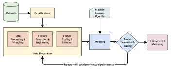
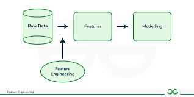

Here's your corrected and properly formatted version of the text with improved grammar and clarity:

---

## What is Feature Engineering?

Feature engineering is the process of extracting meaningful features from raw data. These features can significantly improve the performance of machine learning algorithms.
Features are the attributes or columns in a dataset.

---

## Categorized Feature Engineering

* **Feature Transformer & Imputation**

  * Missing Value Imputation
  * Handling Categorical Features
  * Outlier Detection
  * Feature Scaling
* **Feature Construction**
* **Feature Selection**
* **Feature Extraction**

---

### Missing Value Imputation

Sometimes, while collecting data, there may be missing values due to errors or omissions by data collectors.
Libraries like `sklearn` do not work with missing values during model training, so it is important to handle them beforehand.

You can either remove the missing values or fill them using statistical methods like mean, median, or mode.
You can also use advanced techniques like `SimpleImputer` or `KNNImputer` for imputation.

---

### Handling Categorical Values

Categorical values are non-numeric values such as gender, color, etc.
Libraries like `sklearn` require numerical inputs for model training, so categorical features need to be converted.

You can convert categorical values into numerical form using techniques like:

* **Label Encoding**
* **One-Hot Encoding**

---

### Outlier Detection

Outliers are data points that differ significantly from other observations, such as a salary of 1000 in a dataset where most salaries are in the range of 10–100.

Some algorithms are sensitive to outliers, which can negatively impact model performance.
Hence, detecting and handling outliers is a crucial step in feature engineering.

---

### Feature Scaling

Feature scaling is the process of transforming features to lie within a specific range, usually between 0 and 1.

This step is important because some machine learning algorithms are sensitive to the scale of features.
For instance, a feature representing **age** might range from 20–60, while a **salary** feature might range from 10,000–100,000.
In such cases, the model may give undue importance to the larger-valued feature unless scaling is applied.

---

Let me know if you'd like this in a downloadable format like PDF or Markdown!
